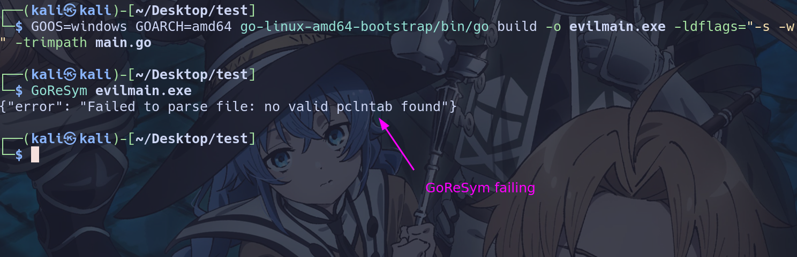
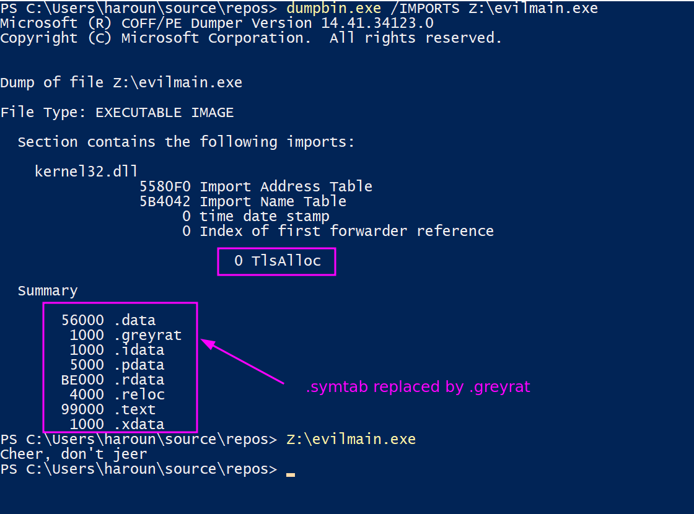

# Evil-Go


evil-go is a fork of go with some tweaks here and there to generate more stealthy binaries. It mainly includes, IAT hiding and GoReSym evasion.

## Usage

First build the project (you need a legitimate go version for that)

```bash
cd src
GOOS=linux GOARCH=amd64 ./bootstrap.bash
```

Then use the created Go binary as you use the legitimate Go.

```bash
GOOS=windows GOARCH=amd64 go-linux-amd64-bootstrap/bin/go build -o evilmain.exe -ldflags="-s -w" -trimpath main.go
```

## What does it do ?

To better undertand lets take an example a simple hello world program.

```go
package main

import "fmt"

func main()  {
    fmt.Println("Cheer, don't jeer")
}
```

If you build it in Go you will have a lot of imported function from Kernel32.dll visible in the IAT (around 50 winapi) and the GoReSym will be able to automatically tell the AV/EDR it is a Go binary.

If you compile with evil-go, your binary will have only 1 imported function (TLSALLOC) and GoReSym will fail.






## Some Notes

- evil-go correctly compiled and gave a working binary for [superdeye basic selfinject example](https://github.com/almounah/superdeye)
- Of course it is **not recommended** to use this in real normal customer production env. The risk of failure is high. I just tweaked the Go compile chain for fun, without tests, without verifying every corner case out there with math like the real Go team does.
- About the GoReSym bypass: the symbols are still in the binary. Unlike the amazing garble, nothing is hidden. Meaning a blueteamer who takes his time will be able to extract the symbols from the binary.
- About the IAT hiding: I wrote an article a while back about how it is implemented, if you are interested [here it is](https://almounah.github.io/posts/iat-hiding/)
- This project is meant as a proof of concept, designed people who use Go to create a dropper.

## Why the name evil-go ?

All the creativity went into making the picture you see above. I tried to find a new name related to some anime but failed. I decided then to go with evil-go.
